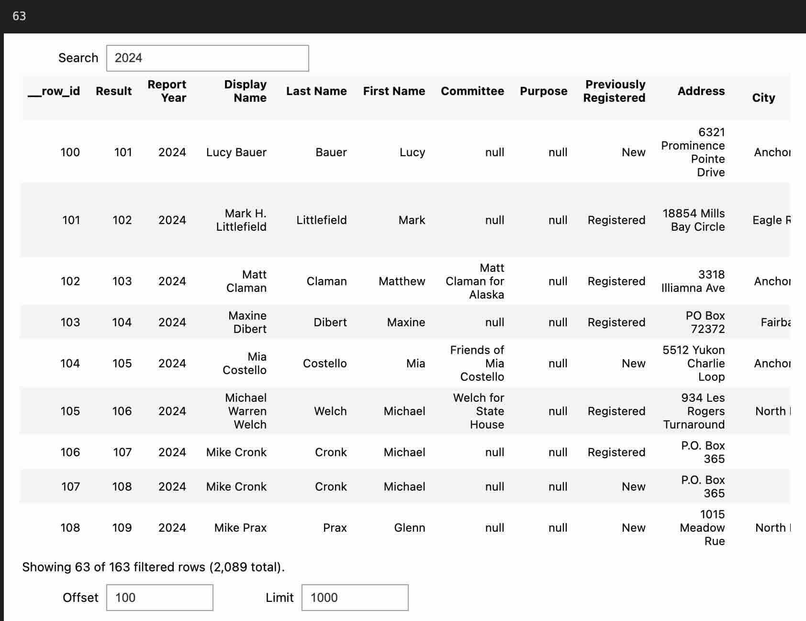

# Ibis-Widget

A lightweight Jupyterwidget for searching and viewing (and later filtering, sorting, etc)
[Ibis tables](https://github.com/ibis-project/ibis)

No dependencies besides `anywidget` and `ibis-framework`
(which you probably already have installed)

-----

Put this in a jupyter notebook:

```python
import ibis
from ibis_widget import IbisWidget

t = ibis.read_csv("https://github.com/NickCrews/apoc-data/releases/download/20240717-111158/candidate_registration.csv")
t = t.cache()
w = IbisWidget(t)
w.offset = 100
w.search = "2024"
w.limit = 1000
print(w.result_table.count().execute())
w
```

This renders a HTML interface with search, scrolling, pagination, etc



You can also do some monkeypatching for a better experience:

```python
from ibis_widget import install

# This adds a method (by default called "widget") to ibis Tables and Columns
install()

t.widget()
# you get the widget as above
```